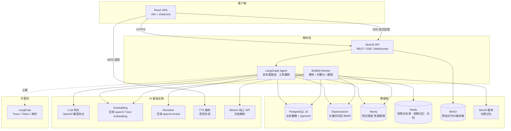

# Enterprise Knowledge Hub — 企业级知识库

基于 **Agentic RAG** 的企业级知识库系统：融合文档管理、混合检索、知识图谱多跳推理、分层记忆与全链路可观测，支持私有化一键部署。

## 核心特性

- **文档管理**：知识空间（Workspace）隔离的多租户文档管理，支持 PDF / Word / Excel / PPT / Markdown / 网页等格式，基于 **MinerU** 高精度解析（版面分析、表格、公式）
- **Agentic 问答**：**LangGraph** 编排的 Agent 自主判断问题复杂度 —— 简单问题走混合检索直答，复杂业务问题自动触发 **Neo4j 图谱多跳推理**
- **混合检索**：Elasticsearch 关键词召回 + PGVector 向量召回，**RRF** 融合打分，**Reranker** 精排
- **分层记忆**：Redis 短期滑动窗口对话摘要 + **Mem0** 用户/会话长期记忆
- **权限安全**：RBAC 三級模型，Redis 缓存用户权限白名单，检索期分片级权限过滤
- **全链路可观测**：**LangFuse** 上报每次问答的耗时、Token 消耗、召回分片与异常
- **多模态输出**：SSE 流式文字推送，可选 TTS 语音经 WebSocket 同步播放

## 系统架构总览



## 技术栈

| 层 | 选型 |
| --- | --- |
| 前端 | React 18 + Vite + shadcn/ui + Tailwind CSS |
| 后端 | NestJS 10 + TypeScript（LangGraph.js 运行于 Node 进程内） |
| Agent 编排 | @langchain/langgraph |
| 数据库 | PostgreSQL 16 + pgvector（HNSW 索引） |
| 全文检索 | Elasticsearch 8（BM25，IK 中文分词） |
| 图数据库 | Neo4j 5（实体多跳推理，Cypher） |
| 缓存 / 队列 | Redis 7 + BullMQ |
| 长期记忆 | Mem0（自托管开源版） |
| 文档解析 | MinerU 线上 API（mineru.net，vlm 模型） |
| 对象存储 | MinIO（S3 兼容） |
| 可观测 | LangFuse（自托管） |
| LLM 接入 | OpenAI 兼容协议（DeepSeek / 通义 / OpenAI 可插拔） |
| 向量 / 排序 | 阿里云百炼 qwen3.7-text-embedding（入库走 Batch API）/ qwen3-rerank |
| 部署 | Docker Compose |

## 文档导航

| 文档 | 内容 |
| --- | --- |
| [docs/01-prd.md](docs/01-prd.md) | 产品需求：角色、场景、功能清单、非功能指标 |
| [docs/02-architecture.md](docs/02-architecture.md) | 系统架构：模块划分、问答全链路（0-9 步）、入库链路、选型决策 |
| [docs/03-database-design.md](docs/03-database-design.md) | 数据设计：PostgreSQL 建表 SQL、Neo4j 图模型、ES Mapping、Redis Key 规范 |
| [docs/04-api-design.md](docs/04-api-design.md) | API 规范：REST 端点、SSE 事件协议、TTS WebSocket 协议 |
| [docs/05-rag-pipeline.md](docs/05-rag-pipeline.md) | **核心**：LangGraph 状态机、混合检索 RRF、图谱多跳、分层记忆、Prompt 组装、LangFuse 埋点 |
| [docs/06-security-permissions.md](docs/06-security-permissions.md) | 权限与安全：RBAC、权限白名单缓存、分片过滤、Prompt 注入防护 |
| [docs/07-deployment.md](docs/07-deployment.md) | 部署运维：全组件 docker-compose、环境变量、资源规格、备份监控 |
| [docs/08-roadmap.md](docs/08-roadmap.md) | 开发计划：M1-M3 里程碑、Backlog（含图谱实体类型演进） |
| [docs/10-benchmark-report.md](docs/10-benchmark-report.md) | 性能压测报告：50 并发问答、入库吞吐、指标对照与归因 |
| [docs/11-backup-restore-sop.md](docs/11-backup-restore-sop.md) | 备份恢复 SOP：四组件备份、恢复流程、降级预案、演练记录 |
| [docs/12-ops-manual.md](docs/12-ops-manual.md) | 运维手册：生产部署、巡检告警、故障处置、安全基线、升级流程 |
| [docs/pitfalls/](docs/pitfalls/README.md) | 坑点记录：工具链/数据库/后端/Agent/中间件/前端分模块沉淀 |

## 快速开始

```bash
# 1. 配置环境变量（LLM_API_KEY / EMBEDDING_BASE_URL 等按需填写）
cp .env.example .env

# 2. 安装依赖
pnpm install

# 3. 一键启动全部服务（Docker 中间件 + API + Worker + Web）
pnpm dev:up

# 4. 创建首个系统管理员（首次）
pnpm seed:admin   # 账号见 .env 的 ADMIN_EMAIL / ADMIN_PASSWORD

# 5. 停止全部服务
pnpm dev:down
```

`dev:up` 自动完成：docker compose 全组件启动 → 等待 PG/ES/Neo4j 就绪 → dist 缺失时自动构建 → 后台拉起 API/Worker/Web。日志在 `logs/{api,worker,web}.log`，已运行的服务自动跳过。

如需前台调试单个服务，仍可分别使用 `pnpm dev:api` / `pnpm dev:worker` / `pnpm dev:web`。

数据库表结构由 TypeORM 启动时自动同步，pgvector 扩展与 HNSW 索引自动幂等创建，无需手动 migration。

详见 [部署与运维方案](docs/07-deployment.md)。

## 当前进度（M1 / M2 / M3 全部完成）

**M1 文档管理 + 基础检索问答**：认证、空间 RBAC、MinIO 分片上传、MinerU 入库管线、混合检索（ES+PGVector+RRF+Reranker）、SSE 流式问答

**M2 Agentic 能力**：LangGraph 完整状态机（复杂度路由 + 节点降级）、Neo4j 图谱构建与多跳推理、图增强检索、分层记忆（Redis 窗口 + Mem0 长期）、LangFuse 全链路 Trace、问答记录与赞踩反馈、对话重命名/删除

**M3 企业增强与上线**：
- TTS 语音：edge-tts 按句合成 + WebSocket 推送 + 前端同步播放与句子高亮（可开关）
- 审计与看板：登录/授权/删除/问答/反馈/越权全量留痕，审计查询 + CSV 导出 + 运营看板（`/admin/stats/overview`），越权 1h×10 次自动告警
- 安全加固：Prompt 注入检测（中英文）、全局限流 + 登录/问答专项限流、日志脱敏、LLM 出站脱敏
- 性能压测：50 并发问答 100% 成功（[报告](docs/10-benchmark-report.md)）
- 备份演练：四组件备份脚本 + 恢复 SOP，全流程演练通过（[SOP](docs/11-backup-restore-sop.md)）
- 生产部署：全组件容器化 + nginx TLS + 健康巡检告警（[运维手册](docs/12-ops-manual.md)）

## 生产部署

```bash
bash scripts/gen-cert.sh your-domain.com         # 生成 TLS 证书（或放置正式证书到 deploy/certs/）
docker compose -f docker-compose.prod.yml up -d --build
# embedding/rerank 使用阿里云百炼（qwen3.7-text-embedding / qwen3-rerank），
# 在 .env 配置 EMBEDDING_API_KEY / RERANKER_API_KEY 即可，无需本地模型
```

日常巡检：`bash scripts/healthcheck.sh [告警webhook]`；备份：`bash scripts/backup.sh`。详见 [运维手册](docs/12-ops-manual.md)。
