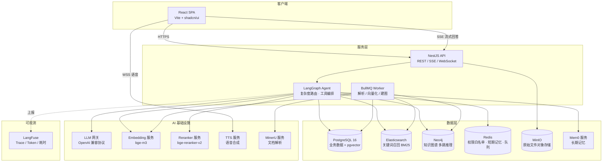

# Enterprise Knowledge Hub — 企业级知识库

基于 **Agentic RAG** 的企业级知识库系统：融合文档管理、混合检索、知识图谱多跳推理、分层记忆与全链路可观测，支持私有化一键部署。

## 核心特性

- **文档管理**：知识空间（Workspace）隔离的多租户文档管理，支持 PDF / Word / Excel / PPT / Markdown / 网页等格式，基于 **MinerU** 高精度解析（版面分析、表格、公式）
- **Agentic 问答**：**LangGraph** 编排的 Agent 自主判断问题复杂度 —— 简单问题走混合检索直答，复杂业务问题自动触发 **Neo4j 图谱多跳推理**
- **混合检索**：Elasticsearch 关键词召回 + PGVector 向量召回，**RRF** 融合打分，**Reranker** 精排
- **分层记忆**：Redis 短期滑动窗口对话摘要 + **Mem0** 用户/会话长期记忆
- **权限安全**：RBAC 三級模型，Redis 缓存用户权限白名单，检索期分片级权限过滤
- **全链路可观测**：**LangFuse** 上报每次问答的耗时、Token 消耗、召回分片与异常
- **多模态输出**：SSE 流式文字推送，可选 TTS 语音经 WebSocket 同步播放

## 系统架构总览



## 技术栈

| 层 | 选型 |
| --- | --- |
| 前端 | React 18 + Vite + shadcn/ui + Tailwind CSS |
| 后端 | NestJS 10 + TypeScript（LangGraph.js 运行于 Node 进程内） |
| Agent 编排 | @langchain/langgraph |
| 数据库 | PostgreSQL 16 + pgvector（HNSW 索引） |
| 全文检索 | Elasticsearch 8（BM25，IK 中文分词） |
| 图数据库 | Neo4j 5（实体多跳推理，Cypher） |
| 缓存 / 队列 | Redis 7 + BullMQ |
| 长期记忆 | Mem0（自托管开源版） |
| 文档解析 | MinerU（独立 Python 服务，HTTP 调用） |
| 对象存储 | MinIO（S3 兼容） |
| 可观测 | LangFuse（自托管） |
| LLM 接入 | OpenAI 兼容协议（DeepSeek / 通义 / OpenAI / Ollama 可插拔） |
| 部署 | Docker Compose |

## 文档导航

| 文档 | 内容 |
| --- | --- |
| [docs/01-prd.md](docs/01-prd.md) | 产品需求：角色、场景、功能清单、非功能指标 |
| [docs/02-architecture.md](docs/02-architecture.md) | 系统架构：模块划分、问答全链路（0-9 步）、入库链路、选型决策 |
| [docs/03-database-design.md](docs/03-database-design.md) | 数据设计：PostgreSQL 建表 SQL、Neo4j 图模型、ES Mapping、Redis Key 规范 |
| [docs/04-api-design.md](docs/04-api-design.md) | API 规范：REST 端点、SSE 事件协议、TTS WebSocket 协议 |
| [docs/05-rag-pipeline.md](docs/05-rag-pipeline.md) | **核心**：LangGraph 状态机、混合检索 RRF、图谱多跳、分层记忆、Prompt 组装、LangFuse 埋点 |
| [docs/06-security-permissions.md](docs/06-security-permissions.md) | 权限与安全：RBAC、权限白名单缓存、分片过滤、Prompt 注入防护 |
| [docs/07-deployment.md](docs/07-deployment.md) | 部署运维：全组件 docker-compose、环境变量、资源规格、备份监控 |
| [docs/08-roadmap.md](docs/08-roadmap.md) | 开发计划：M1-M3 里程碑、任务拆解、验收标准 |

## 快速开始

```bash
# 1. 配置环境变量（LLM_API_KEY / EMBEDDING_BASE_URL 等按需填写）
cp .env.example .env

# 2. 安装依赖
pnpm install

# 3. 启动基础设施（PG/Redis/ES/Neo4j/MinIO；MinerU 与 LangFuse 见部署文档）
docker compose up -d postgres redis elasticsearch neo4j minio

# 4. 构建并启动应用（三个终端）
pnpm build
pnpm dev:api      # API:      http://localhost:8080/api/docs
pnpm dev:worker   # 入库 Worker（文档解析/向量化/建图）
pnpm dev:web      # Web:      http://localhost:5173

# 5. 创建首个系统管理员
pnpm seed:admin   # 账号见 .env 的 ADMIN_EMAIL / ADMIN_PASSWORD
```

数据库表结构由 TypeORM 启动时自动同步，pgvector 扩展与 HNSW 索引自动幂等创建，无需手动 migration。

详见 [部署与运维方案](docs/07-deployment.md)。

## 当前进度（M1 已验证）

- 认证：注册/登录/双 Token 刷新/吊销、登录失败锁定
- 权限：空间三角色 RBAC、越权 403、Redis 白名单缓存 + 授权主动失效
- 文档：MinIO 分片预签名上传、状态机、进度查询、角色操作拦截
- 问答：LangGraph 全链路（鉴权→改写→路由→混合检索→图谱→记忆→生成）SSE 流式，节点级降级与耗时观测
- 入库：Worker 消费 BullMQ，MinerU 解析 → 语义分块 → Embedding → PGVector/ES 双写 → Neo4j 建图
