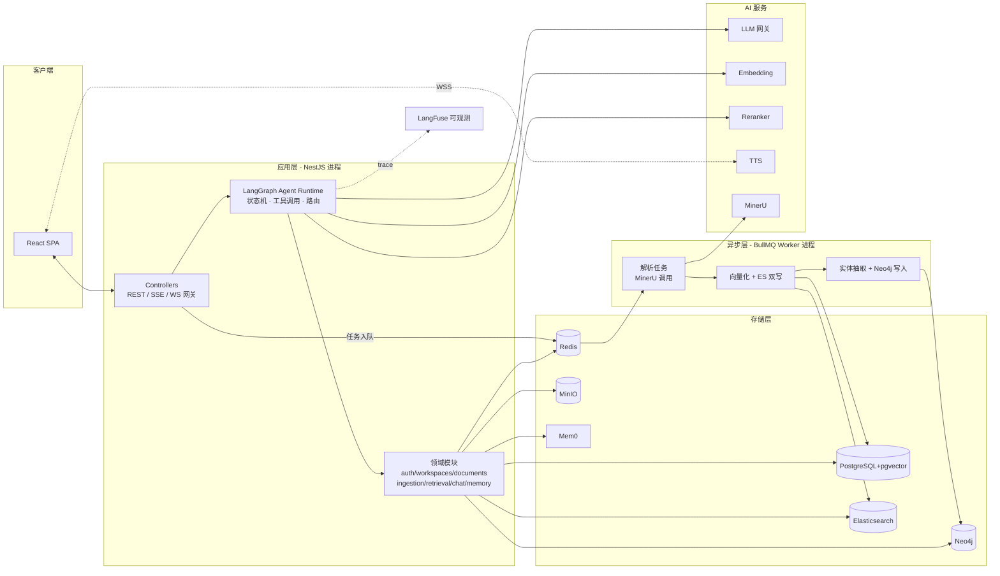
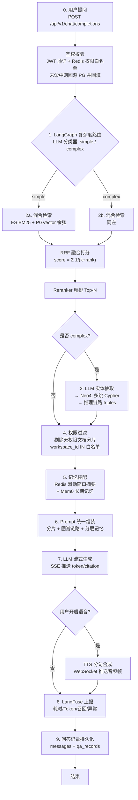
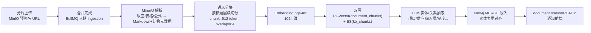

# 02 系统架构设计

## 1. 架构总览

系统采用「单 API 服务 + 异步 Worker + 多存储引擎 + AI 基础设施」的私有化部署架构。LangGraph.js 运行于 NestJS 同一 Node 进程内（避免跨语言 RPC 损耗），MinerU / Mem0 / LangFuse 以独立容器部署，HTTP 通信。



## 2. Agent 问答全链路（核心流程）

对应需求步骤 0-9，下图为 LangGraph 状态机视角的完整链路：



### 步骤说明

| 步骤 | 组件 | 说明 | 降级策略 |
| --- | --- | --- | --- |
| 0 | AuthModule | JWT 校验；`acl:whitelist:{userId}` 缓存用户可见空间集合，TTL 10min | 缓存失效回源 PG |
| 1 | LangGraph Router 节点 | 小模型分类（问题是否需多实体关联推理），输出 simple/complex | 分类失败默认 simple |
| 2 | RetrievalModule | ES `multi_match`(IK 分词) + PGVector `<=>` 余弦，各召回 Top-20 | 单引擎故障退化为单路 |
| - | Fusion | RRF（k=60）融合，Reranker 精排取 Top-6 | Reranker 超时用 RRF 分 |
| 3 | GraphModule | LLM 抽取实体 → 参数化 Cypher 多跳（≤3 跳）→ triples + 路径 | Neo4j 故障跳过，标注降级 |
| 4 | AclFilter | 按 `chunk.workspace_id` 与用户白名单求交，越权分片剔除 | 不过滤视为事故，强制开启 |
| 5 | MemoryModule | Redis `chat:win:{convId}` 取窗口摘要；Mem0 `search(user_id, query)` 取长期记忆 | 任一失败则省略该层 |
| 6 | PromptBuilder | 三段式上下文：检索分片（带 ref_id）/ 图谱 triples / 记忆 | - |
| 7 | ChatModule | LLM stream → SSE；要求引用 `[ref_id]` 标注 | LLM 故障返回友好错误 |
| - | TTS | 按句切分合成，WS 推送 `audio_chunk` | TTS 故障仅关闭语音 |
| 8 | ObservabilityModule | LangFuse Trace：span 覆盖各节点，记录耗时、usage、召回 IDs | 上报异步，不阻塞 |
| 9 | ChatModule | messages 落库；qa_records 记录召回/推理/耗时快照 | - |

## 3. 文档入库链路



- 每步失败独立重试（指数退避，最多 3 次），状态机：`UPLOADED → PARSING → CHUNKING → INDEXING → GRAPHING → READY / FAILED`
- 重建索引 / 重建图谱支持按文档、按空间两种粒度

## 4. NestJS 模块划分

```
apps/api/src/
├── main.ts                      # 全局管道/拦截器/SSE 配置
├── modules/
│   ├── auth/                    # JWT 双 Token、登录、SSO 扩展点
│   ├── users/                   # 用户、角色
│   ├── workspaces/              # 空间、成员授权、权限白名单回源
│   ├── documents/               # 文档 CRUD、分片上传、状态机
│   ├── ingestion/               # BullMQ 生产者；MinerU 客户端
│   ├── retrieval/               # ES/PGVector 召回、RRF、Reranker 客户端
│   ├── graph/                   # Neo4j 驱动封装、实体抽取、多跳查询
│   ├── memory/                  # Redis 窗口摘要、Mem0 客户端
│   ├── agents/                  # LangGraph 状态机定义、节点实现、工具集
│   ├── chat/                    # 对话、SSE 流式、问答记录、反馈
│   ├── llm/                     # LLM/Embedding/Reranker/TTS 统一客户端（OpenAI 兼容）
│   ├── observability/           # LangFuse SDK 封装、Trace 装饰器
│   └── audit/                   # 审计日志
└── common/                      # 拦截器(统一响应)、过滤器(错误码)、守卫(ACL)
apps/worker/src/
├── processors/                  # parse/embed/graph 三个 BullMQ Processor
└── pipelines/                   # 分块器、实体抽取 prompt、Neo4j 写入器
```

## 5. 关键技术决策（ADR 摘要）

| 决策 | 选择 | 理由 | 备选（放弃原因） |
| --- | --- | --- | --- |
| Agent 编排 | LangGraph.js（Node 进程内） | 状态机显式可控、与 NestJS 同语言零 RPC、生态成熟 | Python LangGraph + 独立服务（跨语言运维成本高）；Dify（定制受限） |
| 向量存储 | PGVector（HNSW） | 与业务数据同事务、分片 ACL 过滤一个 SQL 完成、运维组件少 | Milvus（额外集群运维） |
| 关键词检索 | Elasticsearch 8 + IK | BM25 成熟、中文分词、与向量召回互补 | PG tsvector（中文分词弱、排序调优难） |
| 图谱 | Neo4j 5 | Cypher 表达多跳直观、生态成熟 | NebulaGraph（团队学习成本） |
| 长期记忆 | Mem0 自托管 | 记忆抽取/更新/检索开箱即用，支持 user/session 两级 | 自研（重复造轮子） |
| 文档解析 | MinerU | PDF 版面/表格/公式解析质量开源最佳，中文好 | unstructured（表格弱）；Textract（私有化不可行） |
| 可观测 | LangFuse 自托管 | LLM Trace 事实标准，Token/耗时/召回可回放 | LangSmith（SaaS 数据出境） |
| 队列 | BullMQ + Redis | 与 NestJS 集成好，延迟队列/重试内置 | Kafka（重量级） |

## 6. 容量与扩展性

- **无状态 API**：水平扩容，SSE 连接经 Nginx sticky session
- **Worker**：按队列独立扩缩容；MinerU 服务 GPU 节点可单独扩容
- **ES**：单节点起步，数据量 > 500 万 chunk 时扩 3 节点
- **Neo4j**：实体量 < 1000 万单实例足够
- **PGVector**：HNSW（m=16, ef_construction=64），单表千万级内可接受；超出后按 workspace 分区
