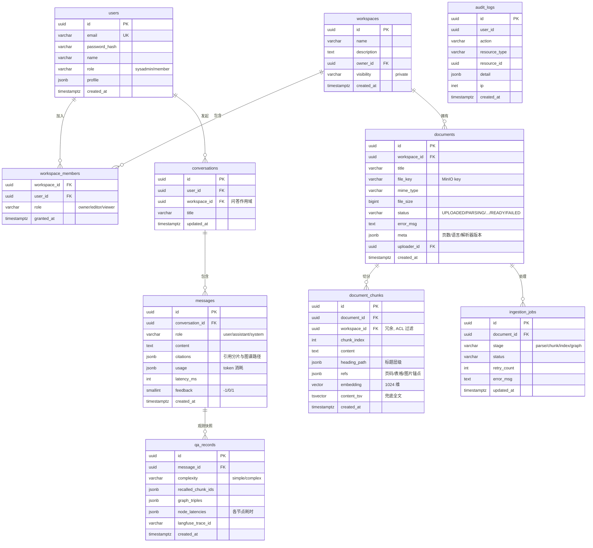

# 03 数据库设计

覆盖四类存储：PostgreSQL（业务 + 向量）、Neo4j（图谱）、Elasticsearch（全文索引）、Redis（缓存/记忆/队列）。

## 1. PostgreSQL 总体 ER



## 2. 核心建表 SQL

```sql
CREATE EXTENSION IF NOT EXISTS vector;
CREATE EXTENSION IF NOT EXISTS pg_trgm;

CREATE TABLE users (
    id            UUID PRIMARY KEY DEFAULT gen_random_uuid(),
    email         VARCHAR(255) NOT NULL UNIQUE,
    password_hash VARCHAR(255) NOT NULL,
    name          VARCHAR(64)  NOT NULL,
    role          VARCHAR(16)  NOT NULL DEFAULT 'member',
    profile       JSONB NOT NULL DEFAULT '{}',
    created_at    TIMESTAMPTZ NOT NULL DEFAULT now(),
    updated_at    TIMESTAMPTZ NOT NULL DEFAULT now()
);

CREATE TABLE workspaces (
    id          UUID PRIMARY KEY DEFAULT gen_random_uuid(),
    name        VARCHAR(128) NOT NULL,
    description TEXT,
    owner_id    UUID NOT NULL REFERENCES users(id),
    visibility  VARCHAR(16) NOT NULL DEFAULT 'private',
    created_at  TIMESTAMPTZ NOT NULL DEFAULT now()
);

CREATE TABLE workspace_members (
    workspace_id UUID NOT NULL REFERENCES workspaces(id) ON DELETE CASCADE,
    user_id      UUID NOT NULL REFERENCES users(id) ON DELETE CASCADE,
    role         VARCHAR(16) NOT NULL CHECK (role IN ('owner','editor','viewer')),
    granted_at   TIMESTAMPTZ NOT NULL DEFAULT now(),
    PRIMARY KEY (workspace_id, user_id)
);
-- 权限白名单回源查询：SELECT workspace_id FROM workspace_members WHERE user_id = $1

CREATE TABLE documents (
    id          UUID PRIMARY KEY DEFAULT gen_random_uuid(),
    workspace_id UUID NOT NULL REFERENCES workspaces(id) ON DELETE CASCADE,
    title       VARCHAR(512) NOT NULL,
    file_key    VARCHAR(512) NOT NULL,
    mime_type   VARCHAR(128) NOT NULL,
    file_size   BIGINT NOT NULL,
    status      VARCHAR(16) NOT NULL DEFAULT 'UPLOADED'
                CHECK (status IN ('UPLOADED','PARSING','CHUNKING','INDEXING','GRAPHING','READY','FAILED')),
    error_msg   TEXT,
    meta        JSONB NOT NULL DEFAULT '{}',
    uploader_id UUID NOT NULL REFERENCES users(id),
    created_at  TIMESTAMPTZ NOT NULL DEFAULT now(),
    updated_at  TIMESTAMPTZ NOT NULL DEFAULT now()
);
CREATE INDEX idx_documents_ws_status ON documents(workspace_id, status);

CREATE TABLE document_chunks (
    id           UUID PRIMARY KEY DEFAULT gen_random_uuid(),
    document_id  UUID NOT NULL REFERENCES documents(id) ON DELETE CASCADE,
    workspace_id UUID NOT NULL REFERENCES workspaces(id) ON DELETE CASCADE,
    chunk_index  INT NOT NULL,
    content      TEXT NOT NULL,
    heading_path JSONB NOT NULL DEFAULT '[]',
    refs         JSONB NOT NULL DEFAULT '{}',   -- {page: 3, bbox: [...], table_id: ...}
    embedding    VECTOR(1024),                  -- bge-m3
    content_tsv  TSVECTOR GENERATED ALWAYS AS (to_tsvector('simple', content)) STORED,
    created_at   TIMESTAMPTZ NOT NULL DEFAULT now(),
    UNIQUE (document_id, chunk_index)
);

-- 向量检索：HNSW，余弦距离
CREATE INDEX idx_chunks_embedding ON document_chunks
    USING hnsw (embedding vector_cosine_ops) WITH (m = 16, ef_construction = 64);

-- ACL 前置过滤 + 向量召回的复合查询样例：
--   SELECT id, content, embedding <=> $1 AS score FROM document_chunks
--   WHERE workspace_id = ANY($2) ORDER BY embedding <=> $1 LIMIT 20;
CREATE INDEX idx_chunks_ws ON document_chunks(workspace_id);
-- 兜底全文检索（ES 故障时降级使用）
CREATE INDEX idx_chunks_tsv ON document_chunks USING gin(content_tsv);

CREATE TABLE conversations (
    id           UUID PRIMARY KEY DEFAULT gen_random_uuid(),
    user_id      UUID NOT NULL REFERENCES users(id) ON DELETE CASCADE,
    workspace_id UUID REFERENCES workspaces(id),
    title        VARCHAR(256) NOT NULL DEFAULT '新对话',
    updated_at   TIMESTAMPTZ NOT NULL DEFAULT now()
);
CREATE INDEX idx_conv_user ON conversations(user_id, updated_at DESC);

CREATE TABLE messages (
    id              UUID PRIMARY KEY DEFAULT gen_random_uuid(),
    conversation_id UUID NOT NULL REFERENCES conversations(id) ON DELETE CASCADE,
    role            VARCHAR(16) NOT NULL CHECK (role IN ('user','assistant','system')),
    content         TEXT NOT NULL,
    citations       JSONB NOT NULL DEFAULT '[]',  -- [{chunk_id, document_id, title, page}]
    usage           JSONB NOT NULL DEFAULT '{}',  -- {prompt_tokens, completion_tokens}
    latency_ms      INT,
    feedback        SMALLINT NOT NULL DEFAULT 0,  -- 1 赞 / -1 踩
    created_at      TIMESTAMPTZ NOT NULL DEFAULT now()
);
CREATE INDEX idx_messages_conv ON messages(conversation_id, created_at);

CREATE TABLE qa_records (
    id                 UUID PRIMARY KEY DEFAULT gen_random_uuid(),
    message_id         UUID NOT NULL REFERENCES messages(id) ON DELETE CASCADE,
    complexity         VARCHAR(16),
    recalled_chunk_ids JSONB NOT NULL DEFAULT '[]',
    graph_triples      JSONB NOT NULL DEFAULT '[]',
    node_latencies     JSONB NOT NULL DEFAULT '{}', -- {retrieval: 320, rerank: 180, ...}
    langfuse_trace_id  VARCHAR(64),
    created_at         TIMESTAMPTZ NOT NULL DEFAULT now()
);

CREATE TABLE ingestion_jobs (
    id          UUID PRIMARY KEY DEFAULT gen_random_uuid(),
    document_id UUID NOT NULL REFERENCES documents(id) ON DELETE CASCADE,
    stage       VARCHAR(16) NOT NULL CHECK (stage IN ('parse','chunk','index','graph')),
    status      VARCHAR(16) NOT NULL DEFAULT 'pending',
    retry_count INT NOT NULL DEFAULT 0,
    error_msg   TEXT,
    updated_at  TIMESTAMPTZ NOT NULL DEFAULT now()
);

CREATE TABLE audit_logs (
    id            UUID PRIMARY KEY DEFAULT gen_random_uuid(),
    user_id       UUID,
    action        VARCHAR(64) NOT NULL,   -- login / upload / chat / grant ...
    resource_type VARCHAR(32),
    resource_id   UUID,
    detail        JSONB NOT NULL DEFAULT '{}',
    ip            INET,
    created_at    TIMESTAMPTZ NOT NULL DEFAULT now()
);
CREATE INDEX idx_audit_time ON audit_logs(created_at DESC);
```

### 设计要点

- `document_chunks.workspace_id` 冗余列：向量召回 SQL 直接 `workspace_id = ANY(白名单)` 完成 ACL 前置过滤，避免 JOIN
- `content_tsv` 作为 ES 故障时的降级全文索引（`simple` 分词，中文按字切分，仅兜底）
- 单表预计千万级 chunk 内不分区；超出后按 `workspace_id` LIST 分区

## 3. Neo4j 图模型

图谱是**知识空间的子资源**：实体按 `{name, workspace_id}` MERGE，不同空间同名实体互不共享。前端只在 `/workspaces/:workspaceId/graph` 浏览该空间子图。


### 节点与关系规范

| 标签 | MERGE 键 | 主要属性 | 来源 |
| --- | --- | --- | --- |
| KnowledgeDocument | `{id}` | title, status, workspace_id | 入库建图 |
| DocumentChunk | `{chunkId}`（PG `document_chunks.id`） | documentId, workspace_id, content, heading, chunkIndex | 入库建图 |
| KnowledgeEntity | `{name, workspace_id}` | type, description, aliases | LLM 抽取 |

- 实体类型（`type` 属性，不是 Neo4j 标签）：`PERSON / DEPARTMENT / PROJECT / COMPANY / PRODUCT / DOCUMENT`；无法归类的实体丢弃（不入库）
- 实体间边统一为 `RELATED_TO`，语义类型在边属性 `relation`：`BELONGS_TO / MANAGES / PARTICIPATES_IN / RESPONSIBLE_FOR / DEPENDS_ON / RELATED_TO`，未知归 `RELATED_TO`
- 查询一律 `workspace_id = $workspaceId`，不跨空间聚合
- 单文档重建：先删该文档节点及其 chunk，再清理同空间无 MENTIONS 的孤儿实体

### 空间子图查询示例（参数化 Cypher）

```cypher
// 列出某空间实体
MATCH (e:KnowledgeEntity {workspace_id: $workspaceId})
WHERE $type IS NULL OR e.type = $type
RETURN e.name, e.type, e.description
LIMIT 200;

// 列出某空间关系
MATCH (a:KnowledgeEntity {workspace_id: $workspaceId})-[r:RELATED_TO]->(b:KnowledgeEntity {workspace_id: $workspaceId})
RETURN a.name, r.relation, b.name, r.weight
LIMIT 500;
```

## 4. Elasticsearch 索引

```json
PUT kb_chunks
{
  "settings": {
    "number_of_shards": 1,
    "number_of_replicas": 0,
    "analysis": {
      "analyzer": {
        "ik_smart_pinyin": { "type": "custom", "tokenizer": "ik_smart" }
      }
    }
  },
  "mappings": {
    "properties": {
      "chunk_id":     { "type": "keyword" },
      "document_id":  { "type": "keyword" },
      "workspace_id": { "type": "keyword" },
      "title":        { "type": "text", "analyzer": "ik_max_word", "search_analyzer": "ik_smart", "boost": 2 },
      "content":      { "type": "text", "analyzer": "ik_max_word", "search_analyzer": "ik_smart" },
      "heading_path": { "type": "keyword" },
      "created_at":   { "type": "date" }
    }
  }
}
```

- 查询时 `terms: {workspace_id: 白名单}` 做 ACL 过滤，与 PGVector 侧双重保障
- 与 PG 一致性：以 PG 为准，ES 通过 Worker 双写 + 每日对账任务兜底

## 5. Redis Key 规范

| Key | 类型 | TTL | 说明 |
| --- | --- | --- | --- |
| `acl:whitelist:{userId}` | Set(workspace_id) | 10 min | 用户可见空间白名单，授权变更时主动失效 |
| `auth:refresh:{userId}:{jti}` | String | 7 d | Refresh Token 状态（吊销列表） |
| `chat:win:{conversationId}` | List(JSON) | 24 h | 短期滑动窗口：最近 N=10 轮消息摘要 |
| `chat:summary:{conversationId}` | String | 24 h | 窗口溢出后的滚动摘要 |
| `chat:rate:{userId}` | String(INCR) | 1 min | 问答限流 20 次/分 |
| `queue:ingestion` 等 | BullMQ 内部 | - | 解析/向量化/建图任务队列 |
| `doc:progress:{documentId}` | Hash | 1 h | 入库进度（stage、百分比），前端轮询/SSE |
| `llm:circuit:{provider}` | Hash | 5 min | LLM 熔断器状态 |

## 6. Mem0 数据归属

Mem0 内部自建存储（其默认用 Qdrant/PG，本方案配置为复用 PostgreSQL + pgvector），逻辑上按两层组织：

- `user_id` 级：用户画像记忆（偏好、角色、历史关注领域）
- `session_id`（= conversation_id）级：会话级事实记忆（「用户上周确认过 A 项目预算口径」）

应用侧只通过 Mem0 API 读写，不直接操作其存储。
