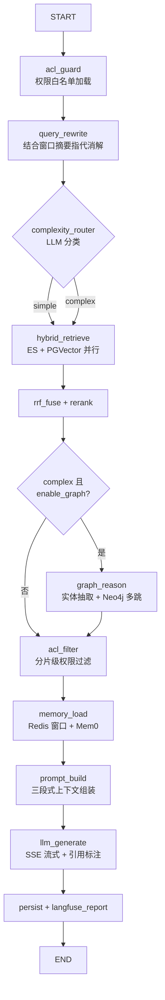
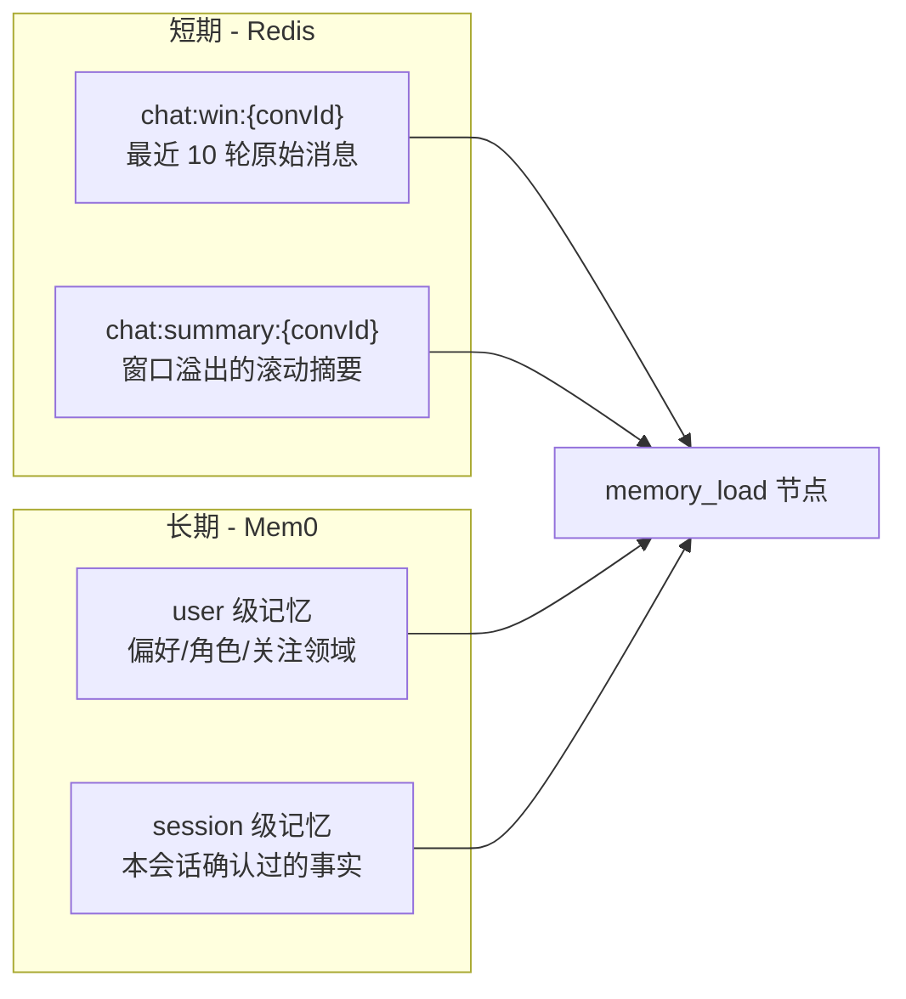

# 05 RAG 与 Agent 核心设计

本文档是系统核心：入库管线（MinerU → 分块 → 双写索引 → 建图）与问答管线（LangGraph 状态机驱动的 0-9 步全链路）。

## 1. LangGraph 状态机

### 1.1 状态定义（AgentState）

```typescript
interface AgentState {
  // 输入
  query: string;                    // 用户原始问题
  userId: string;
  conversationId: string;
  workspaceId?: string;             // 可选：限定空间
  options: { enableGraph: boolean; enableTts: boolean; model?: string };

  // 运行时
  aclWhitelist: string[];           // step0: 可见空间集合
  rewrittenQuery: string;           // 指代消解/改写后的问题
  complexity: 'simple' | 'complex';
  esHits: ChunkHit[];               // ES 召回
  vectorHits: ChunkHit[];           // PGVector 召回
  fusedChunks: ChunkHit[];          // RRF 融合后
  rerankedChunks: ChunkHit[];       // Rerank 后 Top-6
  graphTriples: Triple[];           // 图谱推理链路
  shortTermMemory: string;          // Redis 窗口摘要
  longTermMemory: string[];         // Mem0 记忆条目
  finalPrompt: ChatMessage[];
  answer: string;                   // 流式累积
  citations: Citation[];

  // 观测
  nodeLatencies: Record<string, number>;
  degraded: string[];               // 记录被降级的节点
  error?: string;
}
```

### 1.2 图结构（节点与边）



- 实现：`@langchain/langgraph` 的 `StateGraph`，每个节点为 NestJS Provider 注入的方法
- 节点超时：retrieve 800ms / rerank 500ms / graph 1500ms / memory 300ms，超时记 `degraded` 并继续
- 全程单 Trace：状态机入口创建 LangFuse trace，各节点为 span

### 1.3 复杂度路由（complexity_router）

用小参数模型（如 DeepSeek-V3 / Qwen2.5-7B）做二分类，Prompt 约束输出 JSON：

```text
判断用户问题是否需要「多实体关联推理」。
- simple：单一事实查询、制度条款、定义类。例："差旅住宿标准是多少"
- complex：涉及 ≥2 个实体的关系/链路/对比/追溯。例："A项目的供应商还服务了哪些项目"
只输出 {"complexity":"simple"|"complex","entities":["..."]}
```

- 分类耗时预算 400ms；失败默认 `simple`
- 路由结果通过 SSE `meta` 帧透传前端展示

## 2. 混合检索（hybrid_retrieve）

### 2.1 双路召回（并行执行）

**ES 关键词召回**（Top-20）：

```json
GET kb_chunks/_search
{
  "size": 20,
  "query": {
    "bool": {
      "must": [{ "multi_match": { "query": "...", "fields": ["title^2", "content"], "type": "best_fields" } }],
      "filter": [{ "terms": { "workspace_id": ["w_01", "w_07"] } }]
    }
  },
  "_source": ["chunk_id", "document_id", "title"]
}
```

**PGVector 语义召回**（Top-20）：

```sql
SELECT id AS chunk_id, document_id, content, heading_path, refs,
       1 - (embedding <=> $1::vector) AS vscore
FROM document_chunks
WHERE workspace_id = ANY($2)
ORDER BY embedding <=> $1::vector
LIMIT 20;
```

- `$1` 为改写后问题的 bge-m3 向量（1024 维）
- 两路均做 **ACL 前置过滤**（白名单在 step0 已加载）

### 2.2 RRF 融合

对两路结果按排名融合，常数 \(k=60\)：

\[
\text{score}(d) = \sum_{r \in \{\text{ES},\ \text{Vector}\}} \frac{1}{k + \text{rank}_r(d)}
\]

- 仅在单路出现的文档按另一路「未命中」处理（不加分）
- 融合后取 Top-20 进入 Reranker
- 单引擎故障降级：直接用另一路 Top-20

### 2.3 Reranker 精排

- 模型：`bge-reranker-v2-m3`（HTTP 服务，输入 query + 20 条候选，输出相关度分）
- 取 **Top-6** 进入上下文；得分 < 0.35 的分片丢弃
- 若 Top-1 得分 < 0.3：判定「库内无相关内容」，走兜底话术（避免幻觉），并在 LangFuse 标记 `low_recall`

## 3. 图谱多跳推理（graph_reason，仅 complex）

### 3.1 实体抽取

LLM 从改写后的问题中抽取实体并对齐图内节点：

```text
从问题中抽取实体，类型限于 [Project, Supplier, Person, Policy, Department]。
输出 JSON: [{"name":"A项目","type":"Project"},{"name":"华云科技","type":"Supplier"}]
```

入库抽取使用同一白名单（`entity-extractor.ts` 的 `ENTITY_TYPES`，白名单外类型丢弃）。这 5 类是 v1 封闭集合；扩展或改名须三处对齐并重跑图谱，见 [08-roadmap.md](./08-roadmap.md)「图谱实体类型演进」。

抽取结果先与 Neo4j 做名称模糊匹配（`apoc.text.levenshteinSimilarity` ≥ 0.8）对齐到已有节点，避免「A项目 / A 项目」不匹配。

### 3.2 多跳查询

- 以对齐后的实体为起点，执行参数化 Cypher（≤3 跳，LIMIT 30），见 [03-database-design.md](03-database-design.md) §3.3
- 返回路径转为 triples：`[["A项目","USES_SUPPLIER","华云科技"],...]`
- triples 同时：① 进入 Prompt 上下文 ② 经 SSE `graph_path` 推给前端绘制推理链路 ③ 落入 `qa_records.graph_triples`

### 3.3 图谱结果与分片的互证

Chunk 节点通过 `MENTIONS` 关系连接实体，因此可用图谱命中的实体反查关联分片，补充进候选（与 Rerank 结果去重合并），实现「图增强检索」。

## 4. 权限过滤（acl_filter）

双重保障，缺一不可：

1. **召回前置过滤**：ES `terms filter` + PGVector `workspace_id = ANY(...)`（已执行）
2. **结果级过滤**：Rerank 后逐分片校验 `chunk.workspace_id ∈ aclWhitelist`，剔除越权分片；图谱 triples 关联的 `source_chunk` 同样校验

> 设计原则：即使上游某一路忘记加过滤，结果级过滤兜底，越权内容绝不进入 Prompt。

## 5. 分层记忆（memory_load）



- **短期**：`memory_load` 读取窗口消息 + 滚动摘要；窗口溢出时由 Worker 异步将最老消息压缩进滚动摘要（LLM 摘要，预算 200 token）
- **长期**：`mem0.search({ user_id, query: rewrittenQuery, limit: 5 })`，返回相关记忆条目；答案生成后 `mem0.add(...)` 异步抽取新事实（如「用户确认 A 项目预算口径为含税」）
- 记忆写入失败不阻塞主流程，记 `degraded: ["memory"]`

## 6. Prompt 组装（prompt_build）

```text
[system]
你是企业知识库助手。规则：
1. 仅依据「参考资料」与「知识图谱推理链路」回答，不得编造；
2. 引用资料时用 [数字] 角标标注，与参考资料编号对应；
3. 资料不足时明确说明"根据现有资料无法确认"，并建议联系知识管理员；
4. 回答使用与用户相同的语言，条理清晰，复杂问题分点作答。

[user 上下文区]
## 对话记忆
{滚动摘要 + 最近窗口消息}

## 用户长期记忆
{Mem0 条目，逐条列出}

## 参考资料
[1] 《差旅制度.pdf》P3：{chunk content}
[2] 《供应商名录.pdf》P5：{chunk content}
...

## 知识图谱推理链路
A项目 --USES_SUPPLIER--> 华云科技 --SERVES--> B项目 --OWNED_BY--> 李四
...

## 当前问题
{rewrittenQuery}
```

- Token 预算：system 300 + 记忆 800 + 分片 6×500 + 图谱 600 + 问题 200 ≈ 5100，超限时按「分片得分降序」截断
- 引用角标与 SSE `citation` 帧的 `ref_id` 一一对应

## 7. 生成与输出（llm_generate）

- LLM 流式调用（OpenAI 兼容 `stream: true`），每个 delta 同时：① 推送 SSE `token` ② 累积进 `state.answer`
- 开启 TTS 时：按标点切句，每凑满一句投递 TTS 服务，WS 推送音频帧（见 [04-api-design.md](04-api-design.md) §5）
- 生成完成后正则提取 `[n]` 角标，与 `rerankedChunks` 对齐生成 `citations` 落库

## 8. 入库管线细节

### 8.1 MinerU 解析

- 线上 API（mineru.net）：申请签名上传链接 → PUT 上传 → 轮询批量结果 → 下载 zip 解出 `content_list.json`，映射为结构化块（标题层级、段落、表格 HTML、公式 LaTeX、图片锚点、页码 bbox）
- 支持类型：PDF / Doc / Docx / Ppt / Pptx / Xls / Xlsx（单文件 ≤200MB、≤200 页）
- **纯文本类（md/txt/html）不走 MinerU**：worker 的 `TextParser` 本地解析为同样的结构化块——md 按 `#` 标题层级/围栏代码块/管道表格（转 HTML）切分，txt 按空行分段，html 剥标签；下游分块/索引/建图链路完全复用
- 超时：轮询 15 min；失败重试 3 次后 `document.status=FAILED` 并通知上传人

### 8.2 语义分块策略

| 项 | 策略 |
| --- | --- |
| 切分依据 | 优先按 MinerU 标题层级（H1/H2/H3）切，再按 512 token 二次切分，overlap 64 token |
| 表格 | 整块保留（HTML 转 Markdown），不跨块拆分；超 1024 token 按行组切分并保留表头 |
| 元数据 | `heading_path`（如 ["第三章","报销标准"]）、`refs.page/bbox` 用于前端原文定位 |
| 富化 | 每个 chunk 前拼接「文档标题 > 标题路径」作为上下文前缀再向量化 |

### 8.3 实体抽取与建图

- 按文档级批量抽取：LLM 输入 chunk 序列，输出 `entities[]` 与 `relations[]`（JSON Schema 约束）；实体 `type` 必须落在封闭白名单内
- 写入 Neo4j：`MERGE` 实体（类型+标准化名称为唯一键），`CREATE` 关系并附 `{source_chunk_id, confidence}`
- 同步建立 `(:Chunk {chunk_id})-[:MENTIONS]->(:Entity)` 用于图增强检索（§3.3）
- confidence < 0.7 的关系进入待审核队列（P2 维护台处理）
- 类型集合演进（如 `Supplier` → `Organization`、按需加 `Contract`）见 [08-roadmap.md](./08-roadmap.md)「图谱实体类型演进」，不在 v1 实现

## 9. LangFuse 埋点规范

| Span | 记录内容 |
| --- | --- |
| `acl_guard` | 白名单命中/回源、耗时 |
| `query_rewrite` | 原问题/改写后、模型、usage |
| `complexity_router` | 分类结果、实体、耗时 |
| `hybrid_retrieve` | ES/向量各自命中数、chunk_ids、耗时 |
| `rerank` | 输入/输出排序、Top-6 得分 |
| `graph_reason` | 对齐实体、Cypher、triple 数、耗时 |
| `memory_load` | 窗口大小、Mem0 命中条数 |
| `llm_generate` | model、prompt/completion tokens、首 token 耗时、总耗时 |
| Trace 级 | userId、conversationId、degraded[]、error、feedback（异步关联） |

- 采样率：100%（私有化数据量可控）；上报异步批量，故障时本地缓冲 1000 条丢弃策略
- 看板：按日统计 P95 延迟、Token 成本、low_recall 率、踩赞比

## 10. 质量评估

| 指标 | 方法 | 目标 |
| --- | --- | --- |
| 召回命中率 | 标注 100 条问题集，Top-6 是否含正确分片 | ≥ 90% |
| 答案忠实度 | LLM-as-judge 对照引用分片打分 | ≥ 4.2/5 |
| 引用准确率 | 角标与答案主张一致性抽检 | ≥ 95% |
| 图谱路由准确率 | complex/simple 分类抽检 | ≥ 92% |
| 用户满意度 | 赞/(赞+踩) | ≥ 85% |

评估集随运营持续扩充；每次 Prompt/模型/分块策略变更前跑回归。
