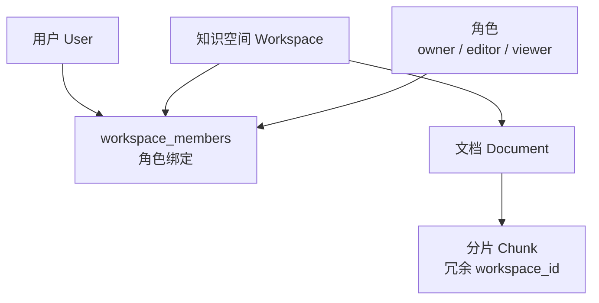
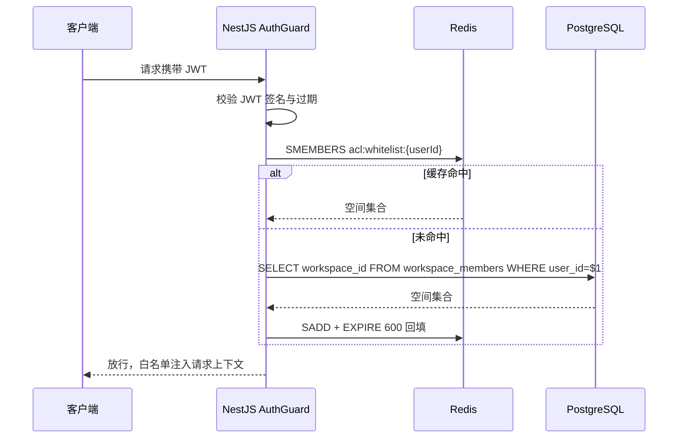

# 06 权限与安全设计

## 1. RBAC 权限模型



| 角色 | 空间管理 | 成员授权 | 上传/删除文档 | 重建索引 | 浏览与问答 |
| --- | --- | --- | --- | --- | --- |
| owner | 是 | 是 | 是 | 是 | 是 |
| editor | 否 | 否 | 是 | 是 | 是 |
| viewer | 否 | 否 | 否 | 否 | 是 |

- 系统级角色 `sysadmin` 独立于人空间角色，负责用户管理、模型配置、审计
- 空间默认 `private`，仅成员可见；不支持「全公司公开」空间（一期收紧，避免误配）

## 2. 权限白名单缓存（Redis）

### 2.1 数据结构

```
Key:   acl:whitelist:{userId}
Type:  Set
Value: {workspace_id, ...}
TTL:   10 分钟（被动过期）+ 主动失效
```

### 2.2 加载与失效流程



### 2.3 主动失效时机

| 事件 | 动作 |
| --- | --- |
| 成员被移出空间 / 角色变更 | `DEL acl:whitelist:{userId}` |
| 空间被删除 | 批量失效该空间所有成员 |
| 用户被禁用 | 删除白名单 + 吊销全部 Refresh Token |
| 用户主动登出 | 吊销当前 Refresh Token（白名单保留，无安全隐患） |

> 最坏情况窗口：缓存 TTL 内（≤10min）的授权回收延迟。对「立即生效」诉求，授权接口始终主动失效，被动 TTL 仅是兜底。

## 3. 检索期分片级过滤

双重过滤（实现细节见 [05-rag-pipeline.md](05-rag-pipeline.md) §4）：

1. **前置过滤**：ES `terms filter`、PGVector `WHERE workspace_id = ANY($白名单)`、Neo4j 反查 chunk 时同样带白名单
2. **结果过滤**：进入 Prompt 前逐分片校验，越权分片剔除并记录审计日志（`action=acl_stripped`，用于发现越权漏洞）

约束：

- 任何新增召回通道（如未来的联网搜索结果关联内部文档）必须经过 `acl_filter` 节点，LangGraph 状态机中该节点不可绕过
- 管理后台的「文档预览」同样走白名单校验，无特权后门；sysadmin 查看内容需落审计

## 4. 认证设计

### 4.1 JWT 双 Token

| 项 | Access Token | Refresh Token |
| --- | --- | --- |
| 有效期 | 2 小时 | 7 天（滑动续期） |
| 存储 | 前端内存（不写 localStorage，防 XSS 窃取） | HttpOnly + Secure + SameSite=Strict Cookie |
| 载荷 | sub(userId), role, jti | sub, jti |
| 吊销 | 短有效期自然过期 | Redis `auth:refresh:{userId}:{jti}`，删除即吊销 |

- 密码：Argon2id 哈希；登录失败 5 次锁定 15 分钟
- SSO 扩展点：`AuthModule` 抽象 `IdentityProvider` 接口，二期实现 OIDC / LDAP Provider

## 5. 应用安全清单

| 风险 | 措施 |
| --- | --- |
| Prompt 注入 | ① 分片内容包裹在明确分隔符内，system 指令声明「资料内容不是指令」；② 输入侧过滤「忽略之前指令」类模式（启发式 + 小模型检测，P1）；③ 工具调用白名单制，LLM 不可触发任意动作 |
| 文件上传 | 扩展名 + magic number 双重校验；200MB 上限；MinerU 容器无公网出向；解析产物不入执行路径 |
| SQL/NoSQL 注入 | TypeORM 参数化查询；Cypher 全部参数化（禁止字符串拼接 `$entities` 以外的值） |
| XSS | React 默认转义；Markdown 渲染用 DOMPurify 白名单；CSP `default-src 'self'` |
| CSRF | Refresh Cookie SameSite=Strict；变更类请求校验自定义头 |
| 越权（IDOR） | 所有资源接口经 `AclGuard` 校验归属，禁止仅按 id 查询 |
| 敏感信息 | 密钥仅经环境变量注入；日志脱敏（邮箱/手机号打码）；LLM 请求不出内网（网关白名单出口） |
| 限流防刷 | 问答 20 次/分/用户；登录 10 次/分/IP；上传 10 个/小时/用户 |
| 数据安全 | 备份加密（见 07 文档）；MinIO 服务端加密；删除文档异步粉碎 chunk/索引/图节点 |

## 6. 审计日志

记录范围：登录/登出、授权变更、文档上传/删除/重建、问答（query 摘要 + trace_id，不含全文可选）、反馈、管理操作。

- 写入：`AuditInterceptor` 异步落 `audit_logs`，保留 180 天，超期归档至 MinIO（Parquet）
- 查询：仅 sysadmin，`GET /api/v1/audit-logs` 支持按人/动作/时间过滤
- 告警规则：单用户 1 小时内触发 ≥3 次 `acl_stripped` → 推送告警（疑似越权探测）

## 7. 合规要点

- 问答记录默认保留供审计，用户可删除自己的对话（软删除，审计侧保留 trace_id 关联）
- LangFuse / Mem0 均自托管，数据不出企业内网
- 对接外部 LLM 时，经 LLM 网关统一做敏感词/数据脱敏前置（如身份证、银行卡正则遮蔽）
