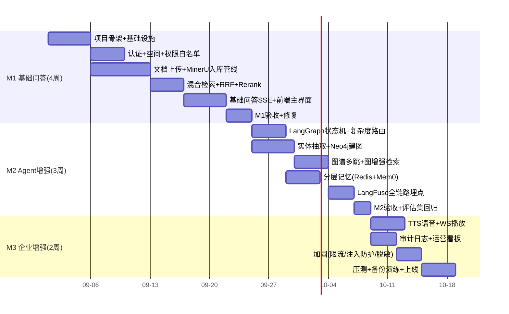

# 08 开发计划与里程碑

总工期 **9 周**，三个里程碑，每个里程碑结束交付可运行版本。人力假设：后端 2 人、前端 1 人、算法/平台 1 人。

## M1 — 文档管理 + 基础检索问答（第 1-4 周）

**目标**：文档可入库、可检索、可流式问答（simple 路径全通）。

| 任务 | 产出 | 验收标准 |
| --- | --- | --- |
| Monorepo 骨架 | pnpm workspace：apps/api、apps/worker、apps/web、packages/shared | lint/test/build 全通 |
| 基础设施编排 | docker-compose 全组件可启动 | `compose up` 后健康检查全绿 |
| 认证模块 | 注册/登录/双 Token/吊销 | 401/刷新/吊销用例通过 |
| 空间与授权 | 空间 CRUD、成员三角色、Redis 白名单 + 主动失效 | 授权变更后 1s 内新权限生效 |
| 文档上传 | 分片上传（MinIO 预签名）、状态机 | 200MB 文件上传可断点续传 |
| 入库管线 | MinerU 解析、语义分块、Embedding、PGVector+ES 双写、进度查询 | 50 页 PDF 入库 ≤ 3min（GPU）/ 8min（CPU） |
| 混合检索 | ES+PGVector 并行召回、RRF、Reranker Top-6、ACL 双重过滤 | 越权分片 0 泄漏（测试用例覆盖） |
| 基础问答 | LangGraph 简化链路（无图谱/无记忆）、SSE token+citation | 首 token P95 ≤ 2.5s；引用可跳转原文 |
| 前端主界面 | 登录、空间、文档列表+上传进度、对话页（流式+引用面板） | 核心路径 E2E 通过 |

## M2 — Agentic 能力（第 5-7 周）

**目标**：complex 路径全通，具备图谱推理与分层记忆。

| 任务 | 产出 | 验收标准 |
| --- | --- | --- |
| 完整状态机 | 按 05 文档 §1 实现全部节点与降级策略 | 节点超时自动降级不中断 |
| 复杂度路由 | LLM 分类器 + entities 输出 | 分类准确率 ≥ 92%（评估集） |
| 图谱构建 | 入库时实体/关系抽取、MERGE 对齐、MENTIONS 关联 | 实体对齐准确率 ≥ 90% |
| 图谱推理 | 实体对齐 → 参数化多跳 Cypher → triples → SSE graph_path | 3 跳查询 P95 ≤ 1.5s；前端推理链路可视化 |
| 图增强检索 | 图谱实体反查 chunk 合并候选 | 复杂问题召回命中率提升 ≥ 8pp |
| 分层记忆 | Redis 窗口 + 滚动摘要 + Mem0 user/session 两级 | 指代消解正确率 ≥ 90%（10 轮内） |
| LangFuse | 全 span 埋点、usage 记录、看板 | 100% 请求有 Trace，可回放召回分片 |
| 问答记录 | qa_records 快照 + 赞踩反馈 | 反馈数据可按日导出 |

## M3 — 企业增强与上线（第 8-9 周）

| 任务 | 产出 | 验收标准 |
| --- | --- | --- |
| TTS 语音 | 按句合成、WS 推送、前端同步播放+高亮 | 首音频帧 ≤ 1.5s；可开关 |
| 审计与看板 | audit_logs、查询接口、越权告警规则 | 授权/删除/问答全量留痕 |
| 安全加固 | Prompt 注入检测、限流、日志脱敏、LLM 网关脱敏 | 渗透测试用例通过 |
| 性能压测 | 50 并发问答、入库吞吐 | 满足 01 文档 §5 指标 |
| 备份演练 | 备份脚本 + 恢复 SOP | 完成一次全流程恢复演练 |
| 上线 | 生产 compose、TLS、监控告警、运维手册 | 上线检查单全绿 |

## 质量保障

- **评估集先行**：M1 结束时沉淀 ≥100 条标注问题（含 30 条复杂图谱问题），M2/M3 每次变更跑回归
- **代码质量**：单测覆盖核心服务（retrieval/acl_filter/prompt_build）≥ 80%；LangGraph 节点有契约测试
- **灰度策略**：M3 先对 1 个部门开放，观察 2 周 low_recall 率与踩赞比后全量

## 风险与应对

| 风险 | 影响 | 应对 |
| --- | --- | --- |
| MinerU CPU 模式慢 | 入库积压 | 队列削峰 + 夜间批量；建议 GPU 节点 |
| 实体抽取质量不稳 | 图谱噪声 | confidence 阈值 + 待审核队列 + 评估集回归 |
| LLM 供应商波动 | 问答中断 | 网关层多供应商 failover + 熔断降级话术 |
| 权限过滤遗漏 | 越权泄漏（高危） | 状态机强制 acl_filter 节点 + 结果级兜底 + 越权告警 |
| Mem0/LangFuse 版本升级不兼容 | 功能退化 | 镜像版本锁定，升级前在 staging 验证 |

## 后续迭代（Backlog）

- SSO（OIDC/LDAP）、组织架构同步
- 图谱维护台（实体合并、关系纠错）
- 答案质量周报（自动汇总踩赞、low_recall 问题清单）
- 多模态问答（图片/表格截图提问）
- OpenSearch 替换 ES（若需更强聚合分析）
